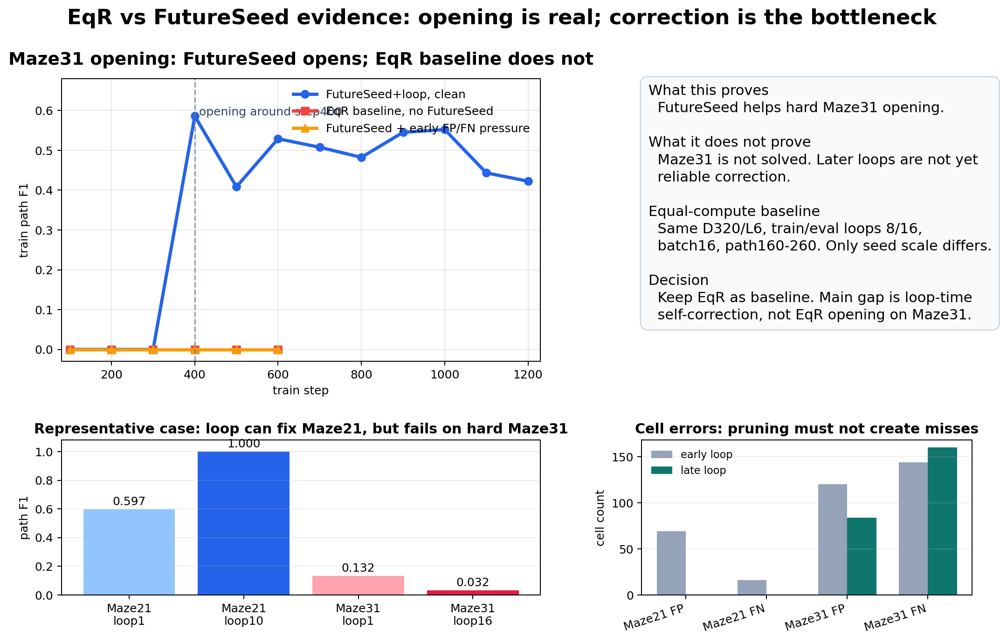
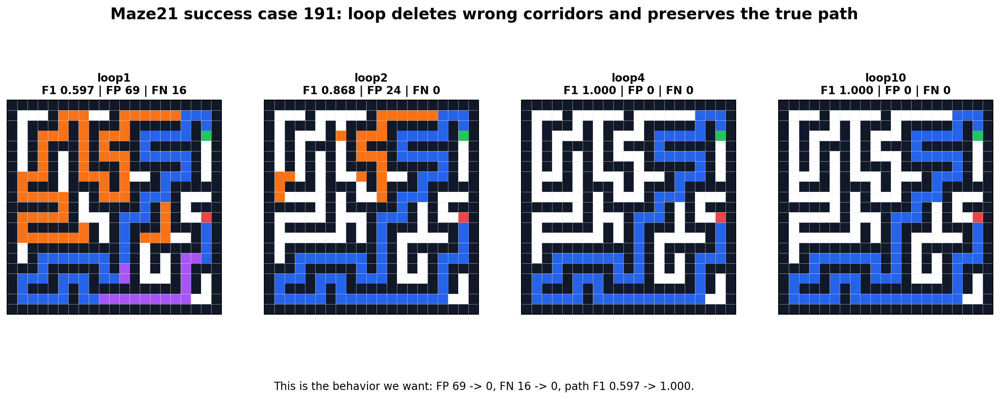
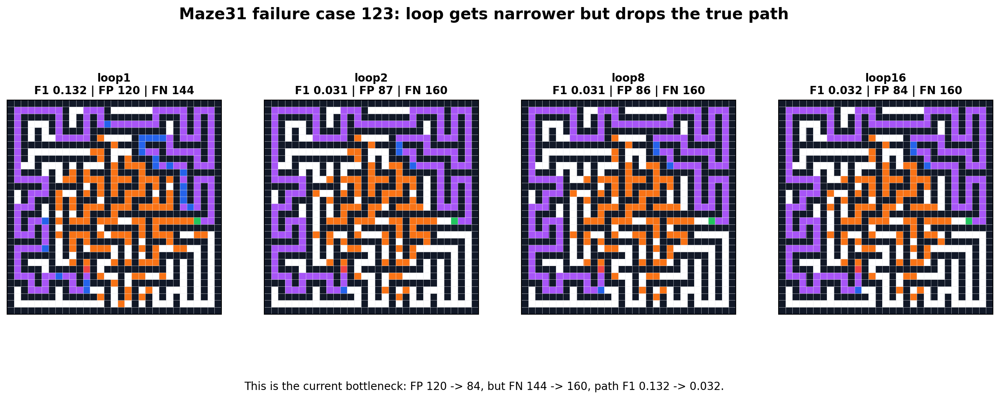

# EqR vs FutureSeed Maze Visual Analysis

This visualization answers the immediate question: if Maze31 is not solved, what does EqR do, and what exactly is FutureSeed+loop doing?

## Main Takeaway

FutureSeed has real opening value on hard Maze31: the equal-compute EqR baseline stayed at path F1 0.0 through step600, while FutureSeed opened around step400. But Maze31 is not solved, and loop-time correction is still the bottleneck.

The contrast is visible in the cases:

- Maze21 case 191 shows the desired behavior: loop removes false-positive corridors and preserves the true path.
- Maze31 case 123 shows the current failure: loop reduces some false positives, but creates more misses and loses the path.

## Figures

## Decision

Do not claim that FutureSeed+loop is already a better full paradigm than EqR. The current supported claim is narrower: FutureSeed improves hard-task opening relative to EqR. The next proof target is loop correction: false positives must decrease while false negatives stay flat or decrease.
