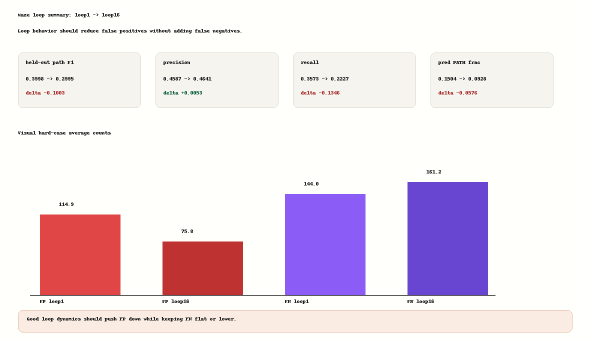
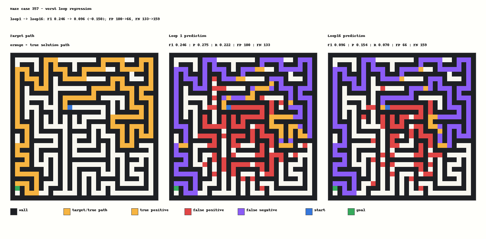
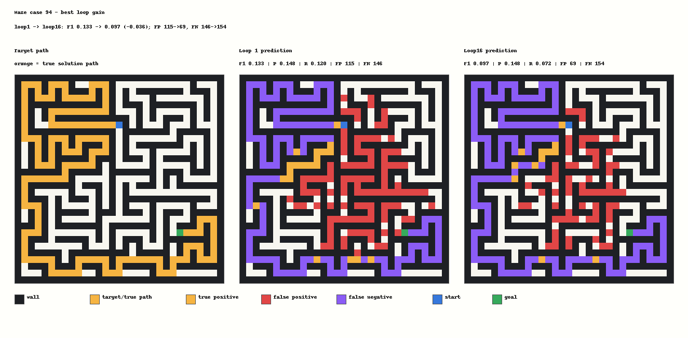

# Maze31 Clean FutureSeed Long Scaling Probe

Run: `maze31-cleanlong-d320l6-loop8x16-s3000-20260621T021639Z-efa5ee6`

Timestamp: `2026-06-21T02:16:39Z`

Source SHA: `efa5ee62dd0a72e94059f48b7d3d50ffa96ad029`

Git dirty: `false`

Provenance note: `source.patch` only captures excluded historical run-index
drift from the reused remote worktree; no model, runner, or training source file
was changed for this probe.

## Question

Does longer clean FutureSeed+loop training naturally turn later loops into a correction mechanism on hard Maze31, without selector, repair, search, maze rules, feature noise, learned gate, Tversky, hard-correction loss, or any hyperparameter sweep?

## Configuration

- Task: perfect Maze31, path length `160-260`
- Model: hidden `320`, layers `6`, heads `8`
- Loops: train `8`, eval `16`
- FutureSeed: enabled, scale `1`
- State update: `none`
- Extra correction losses: none
- Batch/eval: batch `16`, eval `512`
- Steps: `3000`
- GPU: GPU1 only, CUDA, A100 80GB

## Result

The run opened during training, but long training did not create stable loop-time correction.

Training path F1 was noisy after opening:

| step | train CE | train path_f1 |
| --- | ---: | ---: |
| 400 | 0.3711 | 0.0000 |
| 500 | 0.3672 | 0.5304 |
| 1300 | 0.3594 | 0.5728 |
| 2100 | 0.3633 | 0.5733 |
| 2900 | 0.3555 | 0.5988 |
| 3000 | 0.3691 | 0.4133 |

Held-out final eval was worse than the prior 1200-step clean baseline:

| loop | path_f1 | precision | recall | pred_frac |
| --- | ---: | ---: | ---: | ---: |
| 1 | 0.3998 | 0.4587 | 0.3573 | 0.1504 |
| 2 | 0.2983 | 0.4641 | 0.2214 | 0.0922 |
| 8 | 0.2994 | 0.4642 | 0.2226 | 0.0926 |
| 16 | 0.2995 | 0.4641 | 0.2227 | 0.0928 |

Loop16 minus loop1:

- path F1: `-0.1003`
- precision: `+0.0053`
- recall: `-0.1346`
- pred_frac: `-0.0576`
- average false positives: `78.23 -> 47.76`
- average false negatives: `119.35 -> 144.28`

The model does prune predicted mass, but it prunes by dropping true-path cells too. This is not successful correction.

## Visual Evidence

## Interpretation

Clean FutureSeed scaling answers the opening question but not the loop-correction question. The run confirms FutureSeed can escape the EqR-style no-opening failure, but longer training alone makes later loops collapse to a narrow mask: false positives fall, false negatives rise, and F1 drops.

This separates two mechanisms:

- FutureSeed helps optimization/opening on hard proxy tasks.
- Loop compute is not yet learning a robust revise/repair dynamic.

## Decision

Do not continue plain longer-step scaling on this exact Maze31 D320/L6 setup. The next high-ROI direction is not another 3000/5000-step repeat. It should be one of:

- a shorter/harder curriculum probe to stabilize opening without collapse, or
- a more substantial generic FutureSeed/loop state dynamic that preserves true-path mass while pruning false-positive mass.

Still avoid selector, repair, search, maze rules, human prior, gate-bias sweeps, and loss-weight tables.
