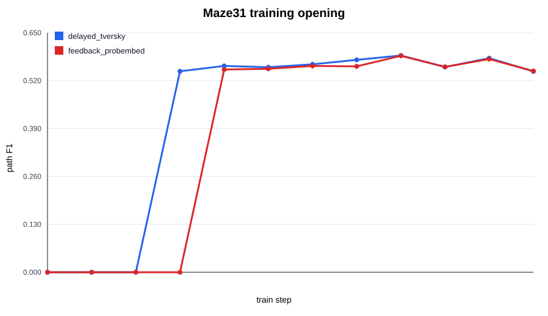
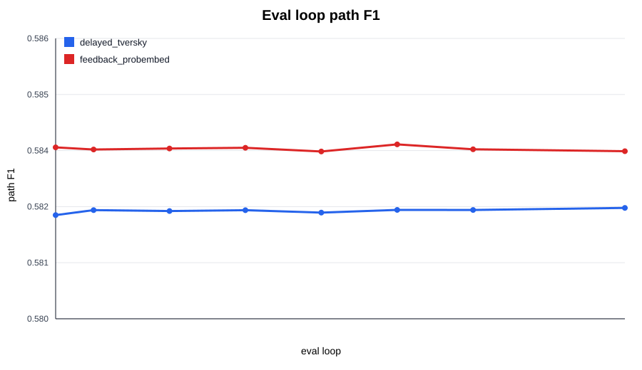
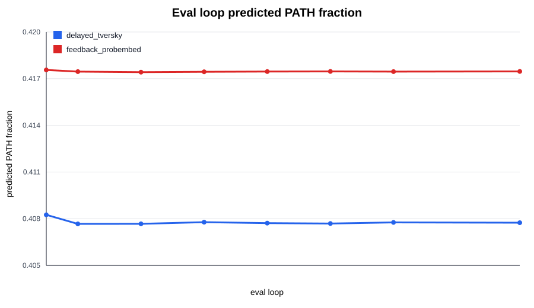

# Maze31 Feedback Probe Analysis

Question: does generic previous-belief feedback make later loops correct the path mask?

## Result

- Delayed Tversky baseline loop16 path_f1: `0.582372`.
- Feedback loop16 path_f1: `0.583586` (`+0.001214`).
- Feedback loop1 -> loop16 path_f1: `0.583669 -> 0.583586` (`-0.000083`).
- Feedback precision: `0.428444 -> 0.428409` (`-0.000035`).
- Feedback pred_frac: `0.417560 -> 0.417465` (`-0.000096`).
- Feedback is active: eval feedback gate `0.126178`, RMS `0.106913`.

## Interpretation

The feedback mechanism is mechanically active and does not hurt the final operating point, but it does not create late-loop self-correction. Loop16 is essentially a copy of loop1: F1 and precision move by less than `1e-4`, and predicted PATH mass barely changes.

This is useful negative evidence. The missing ingredient is not simply that later loops cannot see previous predictions. They can see them here, but the training dynamics still settle into a one-step mask and repeated loops preserve it.

## Next Decision

Do not sweep feedback scale/gate/seed. The higher-ROI next step is to change the recurrent training target or state transition so later loops are rewarded for a measurable correction trajectory, while keeping the method generic: no maze rules, no selector, no repair.

## Figures

