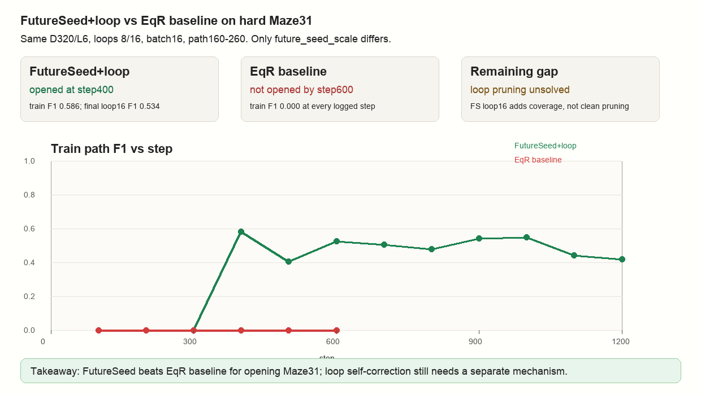

# Maze31 FutureSeed+Loop vs EqR Baseline

Recorded: 2026-06-18T09:10Z

## Question

Can we say FutureSeed+loop is better than EqR on hard Maze31?

This aggregate compares two equal-compute D320/L6 Maze31 runs:

- FutureSeed+loop: `maze31-cleanscale-d320l6-loop8x16-s1200-20260618T0742Z-46a2657`
- EqR baseline: `maze31-eqrbase-d320l6-loop8x16-s1200-20260618T084436Z-2cdb9c5`

The code path is the same except `EQR_FUTURE_SEED_SCALE=1` versus `0`. Both use
Maze31 path `160-260`, batch `16`, train/eval loops `8/16`, hidden `320`, layers
`6`, and no maze rules, repair, search, selector, feature noise, or extra
pruning loss.

## Result

FutureSeed clearly wins the opening/optimization test:

| run | step100 | step300 | step400 | step600 | final |
|---|---:|---:|---:|---:|---:|
| FutureSeed+loop train path F1 | 0.0000 | 0.0000 | 0.5862 | 0.5291 | loop16 eval 0.5344 |
| EqR baseline train path F1 | 0.0000 | 0.0000 | 0.0000 | 0.0000 | aborted |

## Interpretation

This supports a limited but important claim:

FutureSeed is not just a Sudoku trick. On hard Maze31, with the same backbone
size and loop budget, the model without FutureSeed stayed in the no-PATH
solution through step600, while FutureSeed opened at step400.

It does not yet support the stronger claim that FutureSeed+loop has beaten EqR
as a full paradigm. The FutureSeed run still had weak loop gain and its loop16
behavior mostly increased recall/coverage rather than reducing false positives.

## Next Proof Target

The next experiment should target the second criterion directly:

- loop16 must reduce false positives versus loop1;
- false negatives must stay flat or decrease;
- the mechanism must remain generic, simple, and not encode maze rules.

This means the next work should be a simple recurrent decision/state dynamic,
not another baseline repeat, seed sweep, path-loss table, selector, repair, or
maze-specific prior.

## Artifacts

- `comparison.json`
- `fs_vs_eqrbase_opening_curve.png`
