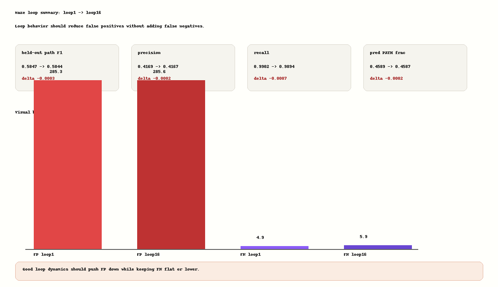
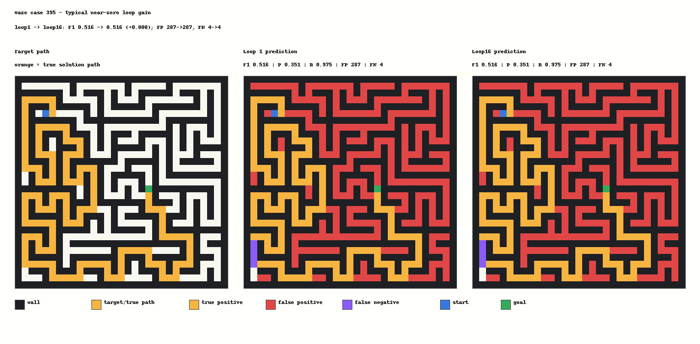

# Maze31 Hard-Correction Probe Analysis

Question: can a generic hard-decision loop-pair target make later loops prune loop1 false-positive PATH cells while preserving true path?

## Result Table

| run | loop16 F1 | loop gain F1 | precision gain | recall gain | pred_frac gain |
|---|---:|---:|---:|---:|---:|
| delayed_tversky | 0.582372 | 0.000153 | 0.000283 | -0.000512 | -0.000504 |
| feedback_probembed | 0.583586 | -0.000083 | -0.000035 | -0.000290 | -0.000096 |
| hardcorr_w025 | 0.584378 | -0.000286 | -0.000164 | -0.000731 | -0.000177 |

## Hard-Correction Diagnostics

- loop1 -> loop16 F1: `0.584663 -> 0.584378` (`-0.000286`).
- precision: `0.416904 -> 0.416740`; recall: `0.990164 -> 0.989434`; pred_frac: `0.458850 -> 0.458673`.
- hardcorr candidate false-positive margin stayed positive: loop16 `0.301017`.
- hardcorr prune success stayed `0.000000`; it did not push loop1 false positives across the PATH boundary.
- hardcorr FP count delta was `-0.029297`, but FN count delta was `+0.140625`. The tiny pruning signal is offset by new false negatives.

## Interpretation

The experiment preserved FutureSeed opening, so this is not an optimization-collapse failure. But the hard-decision correction target did not create recurrent self-correction. The loss remained high and the candidate false-positive margin stayed on the PATH side of the boundary. Later loops made only microscopic changes, with a small false-positive decrease traded against false negatives.

This is useful negative evidence: simply supervising loop1 false positives after opening is still not enough. The bottleneck is not access to labels or a missing previous-prediction channel; it is that the recurrent state transition has no robust mechanism for making a discrete boundary move while preserving the true path.

## Next Decision

Do not sweep hard-correction weight/margins/seed. The next high-ROI path should change the state dynamics itself in a very small way, or change the training setup so later loops are forced to solve progressively stricter targets without turning into a recall tradeoff. Keep it generic: no maze rule, no repair, no selector.

## Figures

