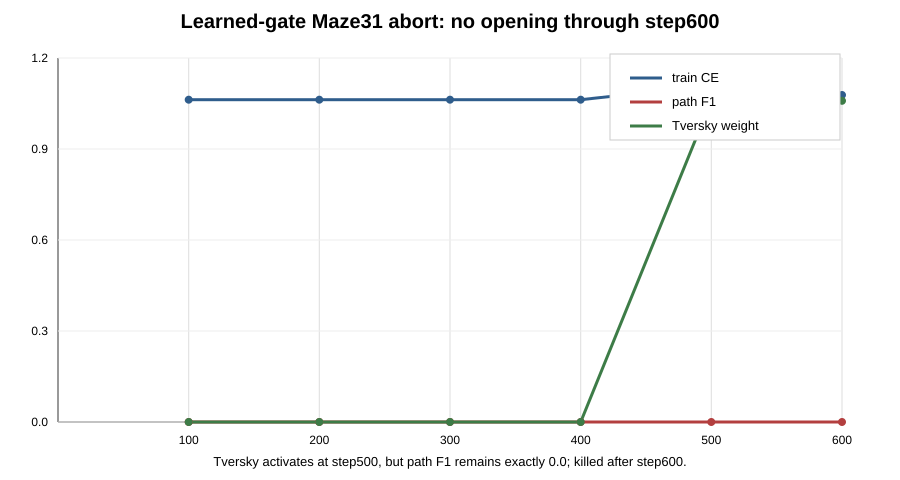

# Maze31 Learned-Gate Delayed-Tversky Abort

Run: `maze31-learnedgate-delayedtv-a450-d320l6-loop8x16-s1200-20260620T155318Z-efa5ee6`

Timestamp: `2026-06-20T15:53:18Z`

Source SHA: `efa5ee62dd0a72e94059f48b7d3d50ffa96ad029`

Git dirty: `false`

Note: `source.patch` contains only excluded historical run-index drift from the reused remote worktree, not model or training-source edits. The run was launched after restoring `leaderboard.csv`; `run.sh` recorded `git_dirty=false` for source/config files.

## Mechanism Hypothesis

FutureSeed gives the initial direction, but later loops still copy a stale operating point unless the recurrent state has a simple learned way to decide how much to preserve versus revise. `EQR_STATE_UPDATE_MODE=learned_gate` was tested as the minimal generic state-dynamics change, with delayed Tversky enabled only after step450 to avoid breaking the opening phase.

This is not a seed, bias, or weight sweep. It is a single test of whether a learned scalar state gate is enough to preserve FutureSeed opening and make late-loop correction trainable on hard Maze31.

## Configuration

- Task: perfect Maze31, path length `160-260`
- Model: hidden `320`, layers `6`, heads `8`
- Loops: train `8`, eval `16`
- FutureSeed: enabled, scale `1`
- State update: `learned_gate`, gate bias `2.0`
- Delayed correction: Tversky `weight=0.75`, `alpha=0.75`, `beta=0.65`, active after step450
- Batch/eval: batch `16`, eval target `512`
- GPU: GPU1 only, CUDA, A100 80GB

## Result

The run was stopped by the predeclared kill criterion at step600. Path F1 stayed exactly zero after delayed Tversky became active:

| step | ce | path_f1 | tversky_weight |
| --- | ---: | ---: | ---: |
| 100 | 1.0625 | 0.0000 | 0.000 |
| 200 | 1.0625 | 0.0000 | 0.000 |
| 300 | 1.0625 | 0.0000 | 0.000 |
| 400 | 1.0625 | 0.0000 | 0.000 |
| 500 | 1.1094 | 0.0000 | 0.750 |
| 600 | 1.0781 | 0.0000 | 0.750 |

Abort metadata is in `abort.json`. The Python process was killed by exact PID `1052`; GPU memory returned to `0 MiB`.

## Interpretation

This is a useful negative result. The same D320/L6 hard Maze31 family has already shown that clean FutureSeed can open around step400, and delayed Tversky alone can preserve opening. Adding learned-gate state dynamics did not preserve that property here; it increased compute cost and stayed in the no-PATH attractor through step600.

The result argues against spending more budget on gate bias, gate width, or Tversky weight sweeps. A learned scalar keep/update gate is too weak or too poorly trained to create the missing late-loop correction behavior.

## Decision

Do not continue learned-gate delayed-Tversky at this scale. The next high-ROI direction should be either:

- return to the clean FutureSeed scaling axis and measure whether larger data/longer training creates loop correction naturally, or
- change the FutureSeed/loop state update more substantially but still generically, with an objective that first preserves opening and then directly rewards loop-time correction.

No maze repair, selector, search, or rule-coded prior was used or should be added.
