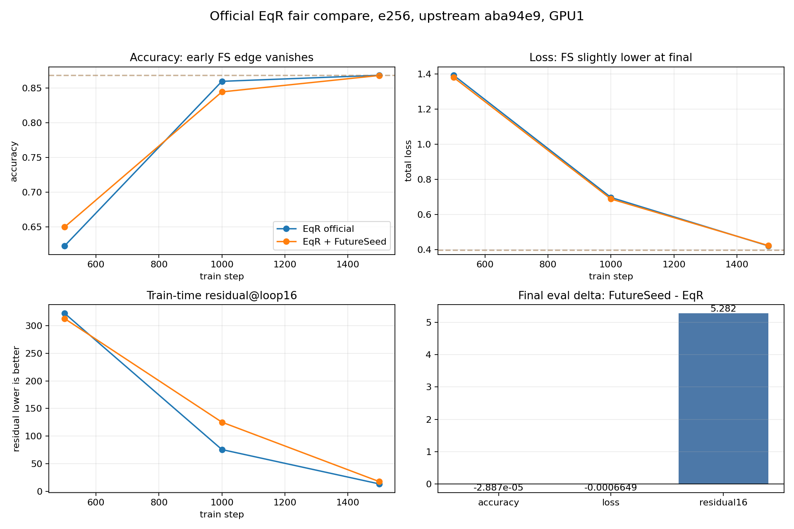

# Official EqR e256 FutureSeed Compare

Timestamp: 2026-06-21

Launcher repo SHA: `aca164e94f08b6b3029e08fbb3802b9d89639379`

Official EqR upstream SHA: `aba94e9cde0f273ce644db5261cd6915ba6561f0`

Remote path: `/huyang2/double-loop/official_eqr_compare`

GPU: GPU1 only, A100 80GB, `CUDA_VISIBLE_DEVICES=0`

## Hypothesis

If FutureSeed is more than a short-budget optimization helper, the step448/500 advantage seen on official EqR should persist or grow under a matched longer training budget. If the advantage disappears, then the current FutureSeed patch is better described as an opening/init aid, not yet a stronger long-budget backbone.

## Setup

Both runs use official locuslab EqR code and official Maze30 unique data. The clean baseline is pristine EqR at `aba94e9`. The FutureSeed branch is the same upstream SHA plus the minimal patch archived in `artifacts/futureseed.patch`.

Matched training budget:

- `epochs=256`
- `train_steps=1792`
- `global_batch_size=128`
- `halt_max_steps=16`
- `eval_global_batch_size=128`
- no selector, no repair, no search, no task-specific rule

## Results

| Readout | EqR official | EqR + FutureSeed | FutureSeed - EqR |
| --- | ---: | ---: | ---: |
| Train eval step500 accuracy | 0.622738 | 0.649879 | +0.027141 |
| Train eval step500 residual16 | 322.635 | 313.089 | -9.546 |
| Train eval step1000 accuracy | 0.859538 | 0.844339 | -0.015199 |
| Train eval step1500 accuracy | 0.868223 | 0.867949 | -0.000274 |
| Final eval accuracy | 0.868250 | 0.868221 | -0.000029 |
| Final eval exact | 0.000000 | 0.000000 | 0.000000 |
| Final eval total loss | 0.398811 | 0.398146 | -0.000665 |
| Final eval residual16 | 404.176 | 409.458 | +5.282 |

Lower loss and residual are better. The train-time eval residual and standalone `evaluate.py` residual are not on the same apparent scale, so compare each readout only within the same row/source.

## Interpretation

FutureSeed has a real early optimization signal in official EqR: by step500 it has higher token accuracy and lower residual than clean EqR. That signal does not survive as a clear long-budget advantage. By step1000 clean EqR catches up and has better loop residual; by final eval both have exact 0 and nearly identical accuracy.

This changes the paper framing. The current FutureSeed patch should not be sold as already better than EqR under long matched training. It is evidence for faster opening / better initialization of recurrent reasoning. To make it the main contribution, the next experiment must improve how FutureSeed interacts with the loop over training time, or show a regime where early opening matters under fixed compute.

## Decision

Do not run more e256 repeats or seed sweeps. The next high-ROI direction is a mechanism-level FutureSeed schedule/state probe on official EqR:

- keep FutureSeed strong during early opening;
- let the model reduce or gate FutureSeed influence after opening;
- measure whether this preserves the step500 advantage while avoiding the step1000/final residual penalty.

This stays within the bitter lesson: generic learned state/schedule, more compute-aware training, no maze rules, no repair, no selector.
