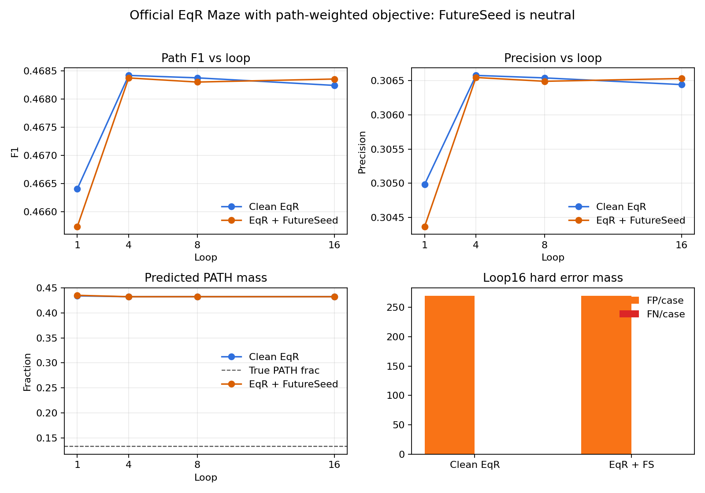

# Official EqR Path-Weighted Maze Compare, 2026-06-21

## Question

Does FutureSeed improve official EqR Maze when the objective is aligned with path recovery?

## Setup

- Official EqR SHA: `aba94e9cde0f273ce644db5261cd6915ba6561f0`
- Source SHA: `fe831c9`
- Dataset: `maze-30x30-unique-1k`
- Objective: generic token CE with `path_token_id=5`, `path_token_weight=8.0`
- Eval: official test cases, 256 examples, no selector/search/repair/postprocessing
- Steps evaluated: loop 1, 4, 8, 16

## Result

| condition | loop1 F1 | loop16 F1 | loop gain | loop16 precision | loop16 recall | pred PATH frac | FP/case | FN/case |
|---|---:|---:|---:|---:|---:|---:|---:|---:|
| clean EqR | 0.4664 | 0.4682 | +0.0018 | 0.3064 | 0.9998 | 0.4325 | 269.9 | 0.03 |
| EqR + FutureSeed | 0.4657 | 0.4684 | +0.0026 | 0.3065 | 0.9999 | 0.4324 | 269.9 | 0.02 |

FutureSeed loop16 delta is `+0.000113` path F1. This is neutral.

## Interpretation

The path-weighted objective turns official EqR Maze from near-zero PATH emission into high-recall broad masks. It does not solve the task: exact accuracy remains zero and each case still carries about 270 false-positive PATH cells.

FutureSeed does not materially improve this official EqR setting. The likely reason is mechanistic, not just noise: EqR's mixer already gives noncausal/global interaction, so FutureSeed's cheap future-context role is masked. This supports using official EqR as the strong baseline/boundary, while the positive paper mechanism should be tested on causal/recurrent backbones where future context is genuinely missing.

## Files

- `base/index.html`: clean EqR hard-case visualization
- `futureseed/index.html`: FutureSeed hard-case visualization
- `comparison.json`: machine-readable metrics and training curves
- `score.json`: leaderboard-friendly score summary
