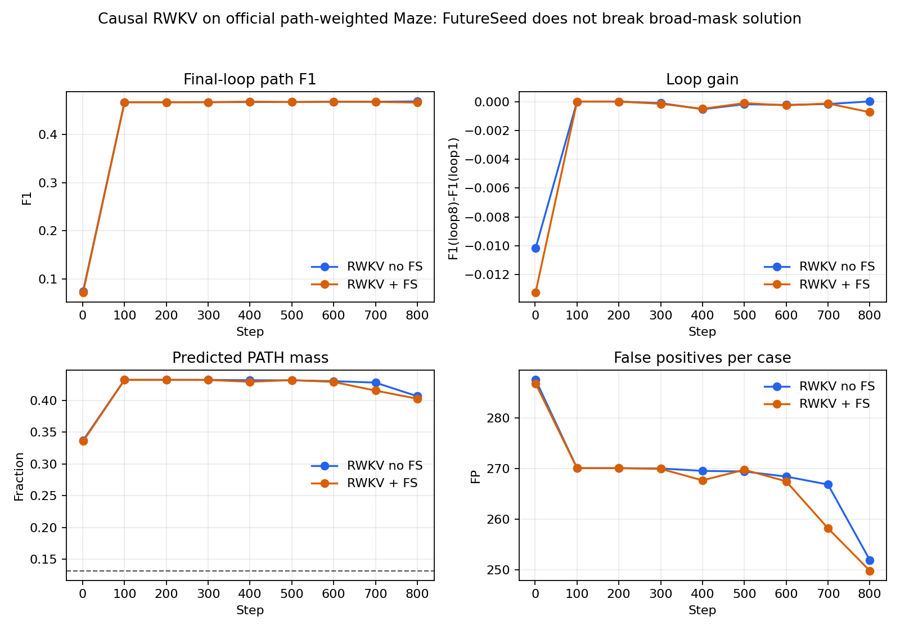

# Causal RWKV Official Maze FutureSeed Compare, 2026-06-21

## Question

Can FutureSeed give a causal RWKV7 state-passing backbone cheap future context on official Maze30 path recovery?

## Setup

- Source SHA: `1ad39c4`
- Data: official `maze-30x30-unique-1k`
- Backbone: causal RWKV7 state-passing, D128/L8/H8, train loops 4, eval loops 8
- Objective: all-loop supervised token CE with `path_token_id=5`, `path_weight=8`
- No selector, search, repair, or maze-specific postprocessing

## Result

| condition | loop8 F1 | loop gain | precision | recall | pred PATH frac | FP/case | FN/case |
|---|---:|---:|---:|---:|---:|---:|---:|
| RWKV no FutureSeed | 0.4690 | +0.0000 | 0.3119 | 0.9580 | 0.4065 | 252.0 | 5.0 |
| RWKV + FutureSeed | 0.4666 | -0.0007 | 0.3111 | 0.9464 | 0.4026 | 249.8 | 6.4 |

FutureSeed delta is `-0.0024` path F1.

## Interpretation

Both causal RWKV arms rapidly converge to the same broad-mask operating point already seen in official EqR path-weighted Maze. This does not support a positive FutureSeed Maze claim. The useful insight is that this proxy/objective mostly rewards high-recall PATH coverage and does not force the model to choose the unique path.

Next paper-positive experiment should use a task/evaluation where future context is necessary and broad-mask coverage is not a cheap solution, or add a generic set/contrastive objective that directly distinguishes false-positive path cells without encoding maze rules.

## Files

- `nofs/visualizations/index.html`
- `futureseed/visualizations/index.html`
- `comparison.json`
- `score.json`
